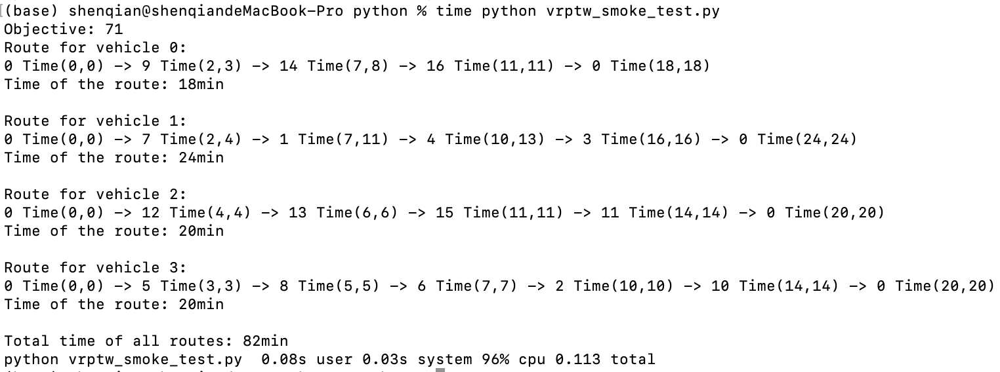

# Weekly Progress Log

> Update this file **every week**. Add a new entry at the top for each week.
> This is the first thing we check during review. Keep it honest and specific — it also feeds your attendance record (Rule 1).

**How to use:** copy the *Week template* block below for each new week. Newest week goes at the top.

---

## Week template — copy me

### Week N — YYYY-MM-DD

**Attended this week's meeting:** Yes / No (if No, did you email leave? Yes / No)

**Progress this week**
- _What did you actually do / finish?_

**Challenges & blockers**
- _What got in the way? What are you stuck on?_

**Next steps**
- _What will you do next week?_

**Hours spent (optional):** _e.g. 6h_

**Links (optional):** _commits, notebooks, docs, datasets..._

---

<!-- =================  YOUR ENTRIES BELOW  ================= -->

### Week 2 — 2026-06-29

**Attended this week's meeting:** Yes / No (if No, did you email leave? Yes / No)

**Progress this week**
- _What did you actually do / finish?_

| Methodology | Problem Scale (Number of Clients) | Feasibility Status | Objective Value (No Augmentation) | Objective Value (With Augmentation) | Total Runtime (Minutes) |
|-------------|-----------------------------------|---------------------|-----------------------------------|-------------------------------------|-------------------------|
| POMO (Basic CVRP, no E/TW constraints) | 50 | Fully Feasible | 10.9186 | 10.7185 | 0.33 |
| POMO (Basic CVRP, no E/TW constraints) | 100 | Fully Feasible | 15.8316 | 15.7418 | 1.75 |
| GA (with E constraint) | 50 |  |  | — |  |
| GA (with E constraint) | 100 |  |  | — |  |
| OR (MILP for UAV-Truck problem) | 50 |  |  | — |  |
| OR (MILP for UAV-Truck problem) | 100 |  |  | — |  |

**Challenges & blockers**
- _What got in the way? What are you stuck on?_

**Next steps**
- _What will you do next week?_

**Hours spent (optional):** _e.g. 6h_

**Links (optional):** _commits, notebooks, docs, datasets..._

---

### Week 1 — 2026-06-12

**Attended this week's meeting:** Yes 

**Progress this week**
- Set up a repository from the FURP template.
- Complete Project Info in repo root README.md
- Finished Python + OR-Tools environment deployment, full environment record as below:
  - Operating system: macOS Sequoia 15.1
  - Python version: Python 3.13.5
  - Package manager: pip
  - OR-Tools solver version: 9.15.6755
  - Exact install command: `python -m pip install ortools`
  - Runtime hardware: Apple M4, 16GB RAM
- Run tiny VRPTW instance smoke test, saved all required outputs
  - command: `time python vrptw_smoke_test.py`
  - instance name and size: Tiny VRPTW, 1 depot + 16 customer nodes, 4 vehicles
  - objective value: 71
  - feasibility status: Feasible
  - runtime: 0.113s (Total)
  - textual route output: 
- Write a reflection paragraph: The time window constraint for each customer was the easiest constraint to understand, as it simply defines a fixed delivery time range that each vehicle must comply with and the printed solution window clearly shows the valid arrival interval for every node. The distinction between the objective value and the total route runtime in the terminal output was confusing at first, since I initially mixed up weighted cost counted by the objective function and the simple summation of physical travel and waiting times. For Week 2, the baseline target is complete VRPTW literature review, sort out standard VRP data formats, and prepare readable notes & problem diagram based on the OR-Tools classical VRPTW baseline.

**Challenges & blockers**
- Understanding the mapping between OR-Tools' internal routing indices (Index) and original node identifiers (NodeIndex) was initially challenging; it required explicit conversion using manager.IndexToNode.
- Confusion arose regarding the definition of the "Objective Value," but it was clarified after analyzing the solver’s cost evaluation and finalizer functions.

**Next steps**
- complete VRPTW literature review, sort out standard VRP data formats, and prepare readable notes & problem diagram based on the OR-Tools classical VRPTW baseline.

**Hours spent (optional):10h

**Links**
- OR-Tools VRPTW official reference: https://developers.google.com/optimization/routing/vrptw
- Repository VRPTW source file: [src/experiments/vrptw_smoke_test.py](src/experiments/vrptw_smoke_test.py)
